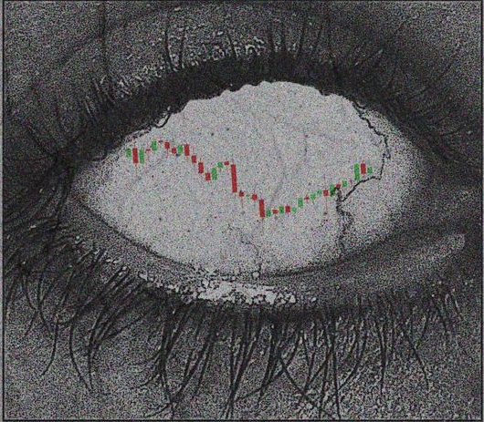

<p align="center">
  
</p>

<h1 align="center">ANTRA — A Data-Driven Trading Bot</h1>
<p align="center">
  Google Data Analytics Professional Certificate — Capstone Project
</p>

<p align="center">
  <a href="https://www.coursera.org/account/accomplishments/specialization/91GTHXPNS4BX"></a>

  
  
  
  
  
</p>

<p align="center">
  <a href="https://github.com/martenzo7"></a>
  <a href="https://linkedin.com/in/osman-fahdawi"></a>
  <a href="mailto:martenzo7@proton.me"></a>
</p>

---

## 📌 Overview

This project is my capstone for the **Google Data Analytics Professional
Certificate**. Instead of a purely exploratory dataset, I applied the
certificate's data analysis process to a domain I wanted hands-on practice
in — **systematic trading** — by building, backtesting, and evaluating a
rule-based trading bot on real historical market data.

The goal wasn't "build something that makes money" (backtests overfit
easily and this is **not financial advice**) — it was to demonstrate the
full analytics lifecycle: asking a clear question, sourcing and cleaning
real-world time-series data, engineering features (technical indicators),
analyzing results with proper statistical rigor, and communicating findings
honestly, including where the approach falls short.

## 🔍 The Data Analytics Process (Ask → Prepare → Process → Analyze → Share → Act)

| Phase | What I did |
|---|---|
| **Ask** | Can a rule-based strategy, built on technical indicators, produce a statistically defensible edge on [asset/market], and under what market conditions does it fail? |
| **Prepare** | Sourced OHLCV (Open/High/Low/Close/Volume) historical data via [`yfinance`](https://pypi.org/project/yfinance/) / [`ccxt`](https://github.com/ccxt/ccxt) for [EUR/USD, BTC/USDT, etc.] at [1h] resolution over [N] days. |
| **Process** | Cleaned and validated the time series (deduplication, timezone handling, gap detection), engineered indicators (RSI, Bollinger Bands, ATR, ADX, Choppiness Index, KAMA), and aligned multi-timeframe features without look-ahead bias. |
| **Analyze** | Backtested each strategy with [`backtesting.py`](https://kernc.github.io/backtesting.py/), evaluating Sharpe ratio, max drawdown, win rate, profit factor, and expectancy — not just raw return. |
| **Share** | This README, [notebook / dashboard link], and [charts/plots] summarizing what worked, what didn't, and why. |
| **Act** | Concrete next steps based on findings — see [Results & Findings](#-results--findings) below. |

## ⚙️ Features

- **Two rule-based strategies**, selectable via config:
  - **RSI + Bollinger Band mean reversion**, with ATR-based stops, a trend
    filter, and a trade cooldown to reduce overtrading.
  - **KAMA (Kaufman Adaptive Moving Average) trend-following**, confirmed
    against a higher timeframe, filtered by ADX (trend strength) and the
    Choppiness Index (range detection).
- **Backtesting engine** with realistic commission modeling and
  equity-at-risk position sizing (risk a fixed % of equity per trade, sized
  off the ATR-based stop distance — not a fixed lot size).
- **Parameter grid-search / optimization**, with an explicit reminder that
  optimized parameters need out-of-sample validation, not blind trust.
- **Paper-trading loop** that reuses the exact same signal logic live,
  logging every simulated trade to CSV for later analysis.
- Supports both **crypto perpetual futures** (via `ccxt`) and **forex pairs**
  (via `yfinance`) from the same codebase.

## 🧰 Tech Stack

<p>
  
  
  
  
  
</p>

## 📊 Data Analytics Skills Demonstrated

- Data collection & sourcing from third-party APIs
- Data cleaning: deduplication, missing-value handling, timezone alignment
- Feature engineering (technical indicators as derived metrics)
- Avoiding look-ahead bias in time-series feature construction
- Statistical evaluation beyond a single summary metric (Sharpe, Sortino,
  Calmar, drawdown duration, expectancy, SQN)
- Honest reporting of negative/null results, not just favorable ones
- Parameter tuning vs. overfitting — the difference between in-sample and
  out-of-sample validation

## 🚀 Getting Started

```bash
git clone https://github.com/martenzo7/antra.git
cd antra
pip install -r requirements.txt
```

Edit the `CONFIG` section at the top of `trade.py` to set your data source,
symbol, timeframe, and which strategy to run (`STRATEGY = "mean_reversion"`
or `"kama_trend"`).

```bash
python trade.py fetch          # download & cache historical OHLCV data
python trade.py backtest       # run a backtest and print performance stats
python trade.py backtest --plot   # ...and save an interactive HTML chart
python trade.py optimize       # grid-search strategy parameters
python trade.py paper          # start the paper-trading loop (no real orders)
```

## 📁 Project Structure

```
├── trade.py            # config, indicators, strategies, backtester, paper trader, CLI
├── requirements.txt
├── data/                # cached OHLCV data (gitignored)
├── logs/                # paper-trading trade logs (gitignored)
└── assets/
    └── banner.png        # README banner
```
<!--
## 📈 Results & Findings
| Strategy | Period | Return | Sharpe | Max Drawdown | Win Rate | # Trades |
|---|---|---|---|---|---|---|
| RSI + Bollinger (mean reversion) | [dates] | [%] | [value] | [%] | [%] | [n] |
| KAMA trend-following | [dates] | [%] | [value] | [%] | [%] | [n] |
-->
**Key takeaway:** [e.g. "The mean-reversion strategy underperformed
buy-and-hold during a sustained trend — expected, since mean reversion is
inherently a range-trading approach. The trend filter reduced trade count by
X% and cut max drawdown by Y%, at the cost of fewer total trades."]

## ⚠️ Disclaimer

This project is for educational purposes as part of a data analytics
capstone. It is **not financial advice**. Backtested performance on
historical data does not predict future results, and trading — especially
with leverage — carries real risk of loss.

## 🎓 About the Certificate

This project was completed as the capstone for the
[Google Data Analytics Professional Certificate](https://www.coursera.org/professional-certificates/google-data-analytics)
, applying the course's end-to-end data analysis methodology to
an original dataset and question of my own choosing.

## 📬 Contact

<p>
  <a href="https://github.com/martenzo7"></a>
  <a href="https://linkedin.com/in/osman-fahdawi"></a>
  <a href="mailto:martenzo7@proton.me"></a>
</p>

## 📄 License

This project is licensed under the [MIT License](LICENSE).
